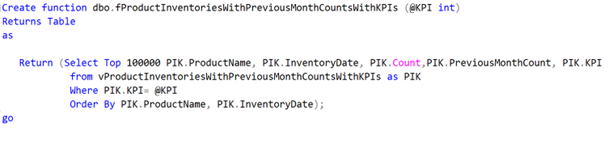

# SQL Functions

## Introduction
**SQL functions** are simply sub-programs, which are commonly used and re-used throughout SQL database applications for processing or manipulating data. Basically, it is a **set of SQL statements that accept only input parameters, perform actions and return the result**. The function can return only a single value or a table. We can't use a function to Insert, Update, Delete records in the database table(s).

## SQL Function
While a view is nothing more than a SQL statement that is stored in the database with an associated name. A function on the other hand returns a single value or a single result set after accepting input parameters.
Functions **foster code reusability**. If there is need to repeatedly write large SQL scripts to perform the same task, then we can create a function that performs that task. Next time instead of rewriting the SQL, specific function can be called.
The basic CREATE FUNCTION syntax is as follows –

 

#### *Fig1: Basic syntax of SQL function*

### View And Functions
In addition to SQL Server's built-in functions, you can create custom functions. These are often called User Defined Functions or just UDFs. There are two basic types of functions; functions that return a table of values and functions that return a single value.

  - Functions and Views are similar as both can return a table of values.
  - Unlike views, functions can use parameters to change the results of the query
  - Unlike views, you can create UDFs to return a single (scalar) value as an expression.

### Type of SQL functions
There are three types of user-defined functions in SQL Server:

- Scalar Functions (Returns A Single Value)
- Inline Table Valued Functions (Contains a single TSQL statement and returns a Table Set)
- Multi-Statement Table Valued Functions (Contains multiple TSQL statements and returns Table Set)

## Difference between different types of functions

### Scalar Functions: 
A scalar function accepts any number of parameters and returns one value. The term scalar differentiates a single, "flat" value from more complex structured values, such as arrays or result sets.  This pattern is much like that of traditional functions written in common programming language.

#### *Fig2: Using a scalar-valued user-defined function that calculates the ISO week*

### Inline Table-Valued Functions: 
This type of function returns a result set, much like a view. However, unlike a view, functions can accept parameters. The inline function's syntax is quite simple. In the function definition, the return type is set to a table. A return statement is used with a select query in parenthesis.

#### *Fig3: Creating an inline table-valued function*

### Multi-Statement Table-Valued Functions: 
Multi-Statement functions can be used to do some unique operations outside the context of a standard SELECT statement. This type of function returns a table-type result set, but the table is explicitly constructed in script. This can be used to accomplish one of two things: either to process some unique business logic by assembling a virtual table on the fly, or to duplicate the functionality of an inline function in a more verbose and compiled way. In short, if you need to select records from an existing result set, use an inline table-valued function.

#### *Fig4: Creating a multi-statement table-valued function*

[Example screenshots are captured from](https://docs.microsoft.com/en-us/sql/t-sql/statements/create-function-transact-sql?f1url=%3FappId%3DDev15IDEF1%26l%3DEN-US%26k%3Dk(FUNCTION_TSQL)%3Bk(sql13.swb.tsqlresults.f1)%3Bk(sql13.swb.tsqlquery.f1)%3Bk(MiscellaneousFilesProject)%3Bk(DevLang-TSQL)%26rd%3Dtrue&view=sql-server-ver16)
